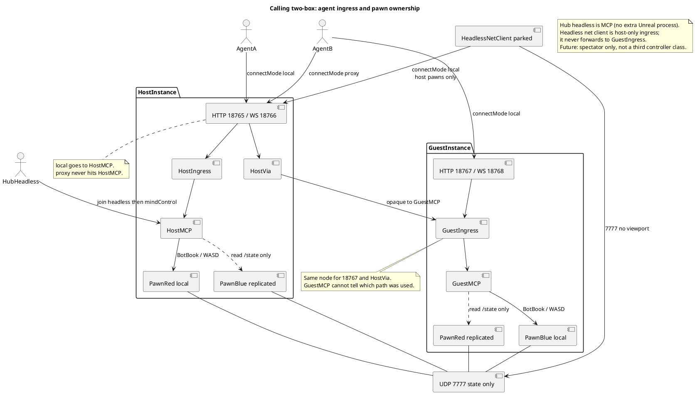

# Virtual multiplayer (same-PC listen)

Two Unreal processes on one machine: **listen server** + **client** over loopback UDP. Not a second net stack. Design spec: [design/agents-and-lobbies.md](../../../design/agents-and-lobbies.md) (parent repo). Agent bring-up: [`.cursor/skills/dl-virtual-mp/SKILL.md`](../.cursor/skills/dl-virtual-mp/SKILL.md).

## What shipped

| Piece | Role |
|-------|------|
| `IpNetDriver` listen on **7777** | Host `?listen`. Guest `ClientTravel` to `127.0.0.1:7777`. |
| `CLLoopbackJoin` | Config `bShowLoopbackJoin` / `LoopbackConnect`. Beacon JSON + `loopback-ipc.log` under **project** `Saved/Calling/`. |
| `UCLSessionSubsystem::StartComposerLoopbackHost` | Composer map + `?game=/Script/Calling.CLComposerGameMode` + `?listen`. Director `virtualhost`. |
| `UCLSessionSubsystem::JoinLoopback` | Resolve combo Loopback vs Beacon, then `ClientTravel`. Refuses if already listen. Director `virtualjoin` (host window only). |
| `UCLSeatRegistry::EnsureNetHuman` | One human seat per `PlayerController`. Host default Red; net guest Blue. `FindForController` matches `BoundController` first. |
| `ACLGameStateBase` lobby snaps | Guest composer menu has no GameInstance seats; it reads replicated `LobbySeats` / ready / min / queued. |
| `ACLPlayerController` Server RPCs | Guest Ready / team. `EnsureComposerMenu` on the **local** client (server cannot create the guest viewport widget). |
| `UCLSceneRouter::SoftTravel` | Appends `?listen` when `NM_ListenServer` so PvP travel keeps both connections. |
| `UCLTravelCoordinator::RestoreBodiesAfterTravel` | Skips seats with `BoundController` (net humans keep their pawns). First human in roster is host; other humans are guests. |
| `ACLGreyboxFloors::Layout` | `ReplicatedUsing = OnRep_Layout`. Missing `Replicated*` fatals the guest on join. |

## Combat net (guns)

Listen-server FPS: owning client predicts recoil, ammo, and tracers; **server** traces and applies damage; **NetMulticast** shows the shot to everyone else. `ApplyDamage` is authority-only — owning-client traces must not mutate replicated HP.

| Piece | Role |
|-------|------|
| `FireShot` (owning client) | Cadence, ammo, recoil, local tracer. Guest does not `ApplyDamage`. |
| `ServerHitscanFire` | `WithValidation`: combat-alive and `Start` within ~300 cm of pawn loc / eye / muzzle. Server clamps start to barrel, traces, `ApplyDamage`. |
| `MulticastHitscanFX` | Unreliable. SimulatedProxy and listen-host spawn the tracer. Owning client already spawned in `FireShot` — skip if `IsLocallyControlled()`. |
| `ServerGrenadeFire` / `ServerDetonateGrenade` | Same start Validate. Spawn the grenade on authority with `bReplicates` + movement (not casings/tracers). Detonate the authority copy so radius hits server `ApplyDamage`. |

Cadence and ammo stay client-predicted. Melee/abilities already go through `ApplyDamage` (no-op on the client). Do not invent a second fire graph. Do not patch Engine.

Parked: named pipe / AF_UNIX NetDriver; shared file as the replication channel; custom NetDriver over WS; dedicated/headless host.

## Why composer listen (not two Social hosts)

Same-process composer Host/Guest is still the ring-verify path. A second **window** is a real Unreal net client: `PostLogin` / `HandleStartingNewPlayer` bind a human seat to that `PlayerController`. `ChoosePlayerStart` uses that seat’s team (Red west, Blue east).

`Map?listen` without `game=` would load Social GameMode via map prefixes. Composer listen URL must include `game=/Script/Calling.CLComposerGameMode`.

## Social listen (lobby composer)

Social is a **second** listen path: same `/Game/Maps/CL_Social` umap, `CLSocialGameMode`, invoice `ECLLobbyAccess`. Overlay **Lobby** tab reloads the instance (private = no listen; public/friends/party = `?listen`). Join is `ClientTravel` to IP:port (director `socialjoin`). Profile `socialDefault` is applied on boot and `ExitActivityToSocial`. Leaving Social for Raid/Practice/Composer **drops listen** (no `?listen` on that travel) so guests are not dragged into the activity.

Two-box Social: host Lobby → Public, guest Lobby → Join `127.0.0.1:7777`. Verify: `Scripts/dl-verify-social-two-box.ps1`. Composer **Virtual host** remains the PvP path.

## Guest MCP (ports + proxy)

`UCLAgentBridgeSubsystem` / `UCLSessionHub` read `AgentHttpPort` / `SessionHubPort`, then cmdline `-CallingAgentHttpPort=` / `-CallingSessionHubPort=`. Default two-box guest is **18767 / 18768**. Each process mints **`instanceId`** (`UCLInstanceIdentitySubsystem`); connecting agents send **`agentId`**. Guest hub `Dispatch` binds a local cursor to the possessed pawn.

**Connect mode** on host 18765/18766 (HTTP header `Calling-Connect-Mode`, WS upgrade/query, or JSON `connectMode`):

- `local` (default) — this process’s hub/MCP.
- `proxy` — host `Via` Client-RPCs the JSON into the **guest ingress** (same node as HTTP 18767). Guest Dispatch cannot tell which path was used. `Calling-Target-Instance` is the guest `instanceId` (from host `/state` seat rows). Two-box shortcut: omit the target if only one net guest is present. `proxy` on the guest port is `cannot_proxy_here`.

Do not send per-op `via` as the primary API; leftover JSON `via` (net-human seat id) still means proxy to that PC (Path B used to be that field; it is now `connectMode: proxy`). Drive JSON should send `intendedTarget` (`localHuman` / `headlessBot` / seat GUID). Drive against a `remoteHuman` hard-fails `remote_player_pawn`. Caller `instanceId` that is not this process hard-fails `instance_mismatch` (omitted = this instance). `LogCallingHub` records `instance`/`agent`/`requestor`/`listenPort`/`recv`/`execPort`; `originInstanceId` is the host when the guest executes a proxied command. Each `ACLPlayerController` stores the last hub receive (`NoteHubReceive`) and replicates `instanceId` so the host can target a guest. Director session actions on the guest return `host_only`. Replication probe stays host 18765 (`GET /state` is always **this** process: host cursors and BoundController humans from **this** `seatList`). A proxy `join` cursor lives on the guest — sample it on 18767, not 18765. See the skill.

## Ingress and pawn ownership

Source: [HubIngress.puml](HubIngress.puml). Two-box shrine clash: Agent A on host `local`, Agent B on guest via **18767** or host **proxy**.

**GuestIngress** sits between HTTP 18767 and GuestMCP. Host Via lands on that **same** node. GuestMCP cannot tell proxy vs 18767.

**Host** in this scenario: 18765 `local` is the only path into HostMCP. `proxy` never hits HostMCP.

**UDP 7777** replicates pawn **state**. It is not a command path. `remote_player_pawn` if HostMCP BotBooks the guest human (or GuestMCP BotBooks the host human).

**Local-controllable:** this process’s `IsLocallyControlled()` pawn — host Red for HostMCP, guest Blue for GuestMCP. WASD / device `requestorId` on that window is the same set. Seat row `boundLocal: true`.

**Remote-claimed:** the other window’s combat body. Host sees Blue as replicated; guest sees Red as replicated. Player or that machine’s MCP owns it. This MCP only reads `/state`. Seat row `boundLocal: false`.

### Headless connectors

**Hub headless** (current Agent A path): `POST /hub` `join {headless:true}` then `mindControl` a **host-local** pawn. This **is** MCP. No extra Unreal process. Same HostMCP; no combat body until mind-control. Circle-run’s second seat on one process is this, not two-box.

**Headless net client** (parked / rare): a third Unreal process joins **7777** with no viewport, then talks **18765 `local`**. Treat as another **host-only** ingress (like Via, but it never forwards to GuestIngress). Controllability is host-local pawns only. Redundant with hub headless. **Future:** keep the process as spectator; do not make it a third combat-controller class. Not this pass.
